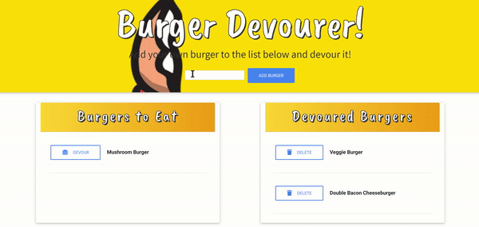

# Eat-Da-Burger

## Overview

Eat-Da-Burger is an application that allows the user to devour burgers with the click of a button and add new burgers to their list of burgers to eat. It works through the use of GET, POST, and DELETE requests connected to a MySQL database. You can find the deployed site [here](https://afternoon-peak-49087.herokuapp.com/). 

## Technologies Used

* External CSS styling Sheet
* Javascript
* JQuery for ajax calls and DOM manipulation
* Handlebars
* Bootstrap
* Node.js
* Express
* MySQL database and NPM package

## Contact Me

 I'm Andrew Weiss. If you have any questions of suggestions you can contact me at my github account [wandrew8](https://github.com/wandrew8).

